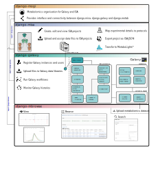

MOGI suite
========================================

Django applications & projects
''''''''''''''''''''''''''''''''''''''''''''''''''

The MOGI suite is a collection of Django applications to manage and organise
metabolomic studies using Galaxy, ISA and Django frameworks.

The suite consist of the following reusable applications:

* :ref:`django-mogi`
* :ref:`django-misa`
* :ref:`django-galaxy`
* :ref:`django-metab`
* :ref:`django-gfiles`

The **django-mogi** application inherits all of the detailed applications below to create ready to go framework for
organising metabolomics studies with Galaxy and ISA. See the `example code <https://domain.invalid/>`_
and an `example site <https://domain.invalid/>`_ for how a Django project utilises the MOGI suite.

However each application has been developed to be
`reusable <https://docs.djangoproject.com/en/2.0/intro/reusable-apps/#reusability-matters>`_ to allow for more general
functionality to be used in other Django projects and applications.

The figure below shows how the applications fit within Django project website

What the MOGI framework can do
''''''''''''''''''''''''''''''''''''''''''''''''''
* Organise metabolomics studies following ISA framework
* Interface with Galaxy (initiate workflows, manage history, inport/export data)
* Search metabolomics spectra across multiple projects (spectral matching, mass search)
* Summarise compound annotations (e.g. from different annotation approaches like MetFrag, CSI:FingerID, spectral matching)

User Documentation
''''''''''''''''''''''''''''''''''''''''''''''''''

.. toctree::
   :maxdepth: 2

   User docs <user-docs/index.rst>

django-mogi
''''''''''''''''''''''''''''''''''''''''''''''''''
The Galaxy interfaces are divided into mzml2isa-galaxy (covering mzML and imzML) and nmrml2isa-galaxy (covering nmrML)

.. toctree::
   :maxdepth: 2

   django-mogi <django-mogi/index.rst>

django-galaxy
''''''''''''''''''''''''''''''''''''''''''''''''''
The command line applications / libraries are currently divided into the mzml2isa package (covering mzML and imzML) and nmrml2isa (covering nmrML).

.. toctree::
   :maxdepth: 2

   django-galaxy  <django-galaxy/index.rst>

django-misa
''''''''''''''''''''''''''''''''''''''''''''''''''
The graphical user interfaces are divided into mzmlisa-qt (covering mzML), imzml2isa-qt (covering imzML) and nmrml2isa-qt (covering nmrML).

.. toctree::
   :maxdepth: 2

   django-misa <django-misa/index.rst>

django-metab
''''''''''''''''''''''''''''''''''''''''''''''''''
The Galaxy interfaces are divided into mzml2isa-galaxy (covering mzML and imzML) and nmrml2isa-galaxy (covering nmrML)

.. toctree::
   :maxdepth: 2

   django-metab <django-metab/index.rst>

django-gfiles
''''''''''''''''''''''''''''''''''''''''''''''''''
Simple file management for generic files in Django

.. toctree::
   :maxdepth: 2

   django-gfiles <django-gfiles/index.rst>

About
''''''''''''''''''''''''''''''''''''''''''''''''''

.. toctree::

   Contacts  <contacts.rst>
