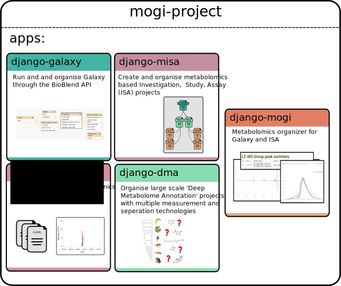

MOGI suite
==========

Overview
-------------

The MOGI suite is a collection of Django applications to manage and organise
metabolomic studies using Galaxy, ISA and Django frameworks.

The suite consist of the following reusable applications:

* :ref:`django-mogi`
* :ref:`django-misa`
* :ref:`django-galaxy`
* :ref:`django-metab`
* :ref:`django-dma`
* :ref:`django-gfiles`

General user
'''''''''''''''''''''''''
Information for general user (rather than developer) can be found here: :ref:`user-docs`

Django applications & projects
'''''''''''''''''''''''''
The **django-mogi** application inherits all of the detailed applications below to create ready to go framework for
organising metabolomics studies with Galaxy and ISA. See the `example code <https://domain.invalid/>`_
and an `example site <https://domain.invalid/>`_ for how a Django project utilises the MOGI suite.

However each application has been developed to be
`reusable <https://docs.djangoproject.com/en/2.0/intro/reusable-apps/#reusability-matters>`_ to allow for more general
functionality to be used in other Django projects and applications.

The figure below shows how the applications fit within Django project website

What the MOGI framework can do
'''''''''''''''''''''''''
* Organise metabolomics studies following ISA standards
* Interface with Galaxy (initiate workflows, manage history, inport/export data)
* Search metabolomics spectra across multiple projects (spectral matching, mass search)
* Summarise compound annotations across multiple projects (e.g. from different annotation approaches like MetFrag, CSI:FingerID, spectral matching)

Deep Metabolome Annotation project (DMAdb)
'''''''''''''''''''''''''
The original use of the MOGI suite of applications is to manage the data generated for Deep Metabolome Annotation (DMA)
projects (large scale untargeted metabolite characterisations). The Django project used for the Deep Metabolome Annotation
project is called DMAdb and is currently hosted the University of Birmingham and can only be accessed locally.

The code for the DMAdb Django project can be accessed `here <https://github.com/computational-metabolomics/django-mogisite-dmadb>`_.

As the MOGI tools were originally designed for DMA projects there is a focus of the management of annotations. However,
the MOGI suite can still be used for organising any metabolomic study where annotations and peaks want to be tracked
and managed across multiple studies.

Documentation
-------------

Overview
'''''''''''''''''''''''''
.. toctree::
   :maxdepth: 2

   MOGI Suit <index.rst>

User Documentation
'''''''''''''''''''''''''

.. toctree::
   :maxdepth: 2

   User docs <user-docs/index.rst>

django-mogi
'''''''''''''''''''''''''
The Galaxy interfaces are divided into mzml2isa-galaxy (covering mzML and imzML) and nmrml2isa-galaxy (covering nmrML)

.. toctree::
   :maxdepth: 2

   django-mogi <django-mogi/index.rst>

django-galaxy
''''''''''''''''''''''''''''''''''''''
The command line applications / libraries are currently divided into the mzml2isa package (covering mzML and imzML) and nmrml2isa (covering nmrML). 

.. toctree::
   :maxdepth: 2

   django-galaxy  <django-galaxy/index.rst>

django-misa
'''''''''''''''''''''''''
The graphical user interfaces are divided into mzmlisa-qt (covering mzML), imzml2isa-qt (covering imzML) and nmrml2isa-qt (covering nmrML). 

.. toctree::
   :maxdepth: 2

   django-misa <django-misa/index.rst>

django-metab
'''''''''''''''''''''''''
The Galaxy interfaces are divided into mzml2isa-galaxy (covering mzML and imzML) and nmrml2isa-galaxy (covering nmrML)

.. toctree::
   :maxdepth: 2

   django-metab <django-metab/index.rst>

django-dma
'''''''''''''''''''''''''
The Galaxy interfaces are divided into mzml2isa-galaxy (covering mzML and imzML) and nmrml2isa-galaxy (covering nmrML)

.. toctree::
   :maxdepth: 2

   django-dma <django-dma/index.rst>

django-gfiles
'''''''''''''''''''''''''
The Galaxy interfaces are divided into mzml2isa-galaxy (covering mzML and imzML) and nmrml2isa-galaxy (covering nmrML)

.. toctree::
   :maxdepth: 2

   django-gfiles <django-gfiles/index.rst>

Other
'''''''''''''''''''''''''

.. toctree::
   :maxdepth: 2

   Other <other/index.rst>

About
-----

.. toctree::

   Contacts  <contacts.rst>
