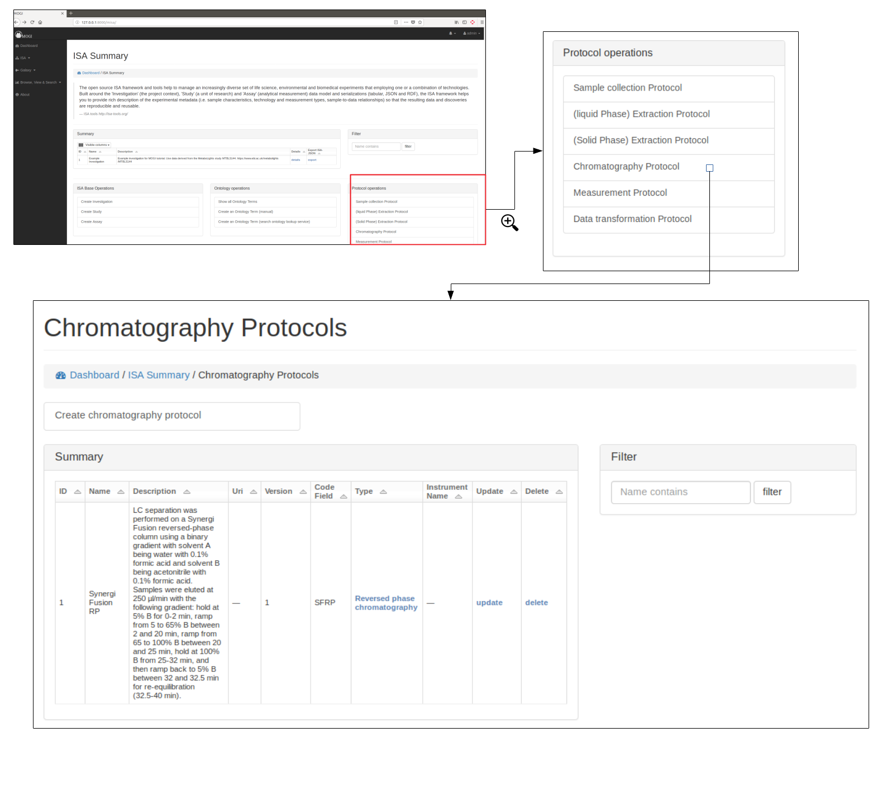
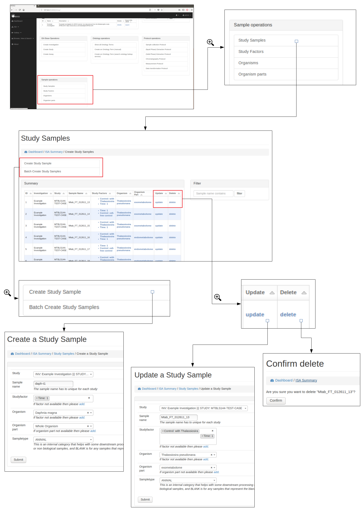
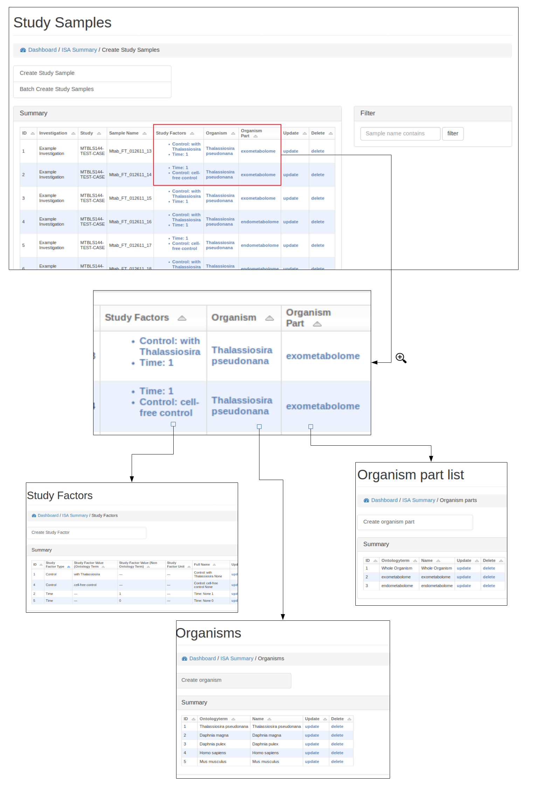
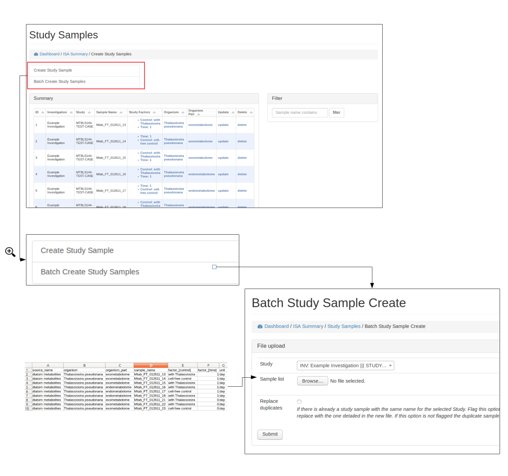
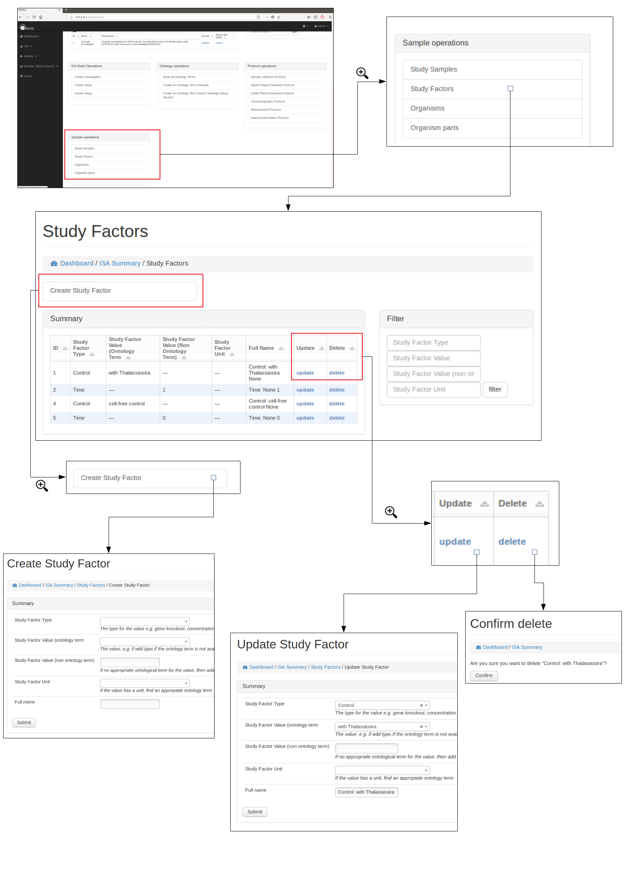
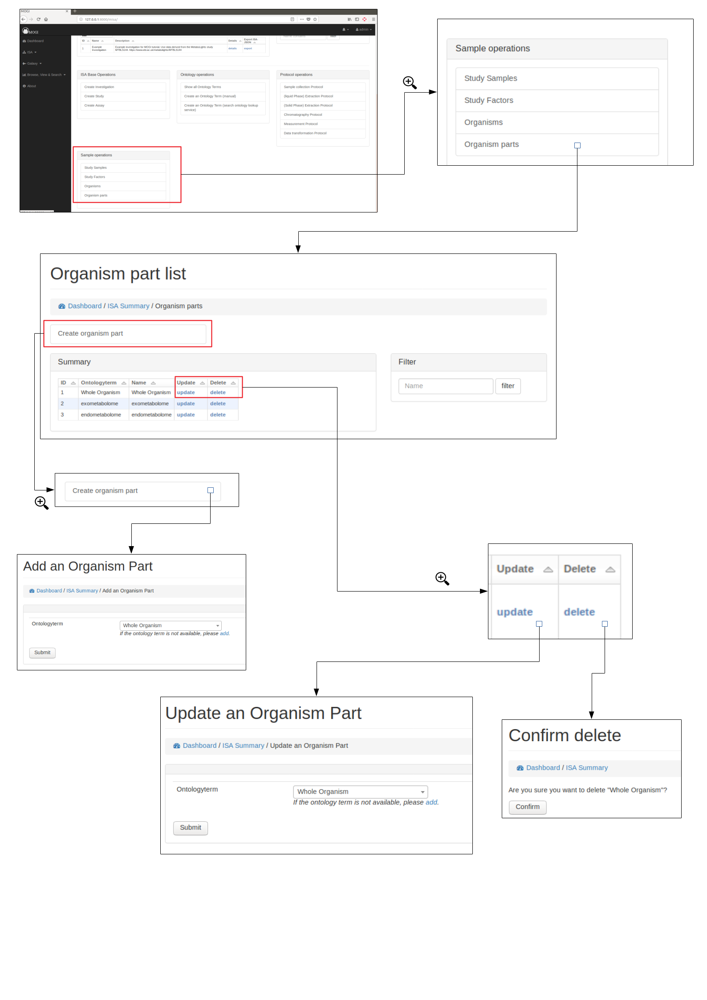
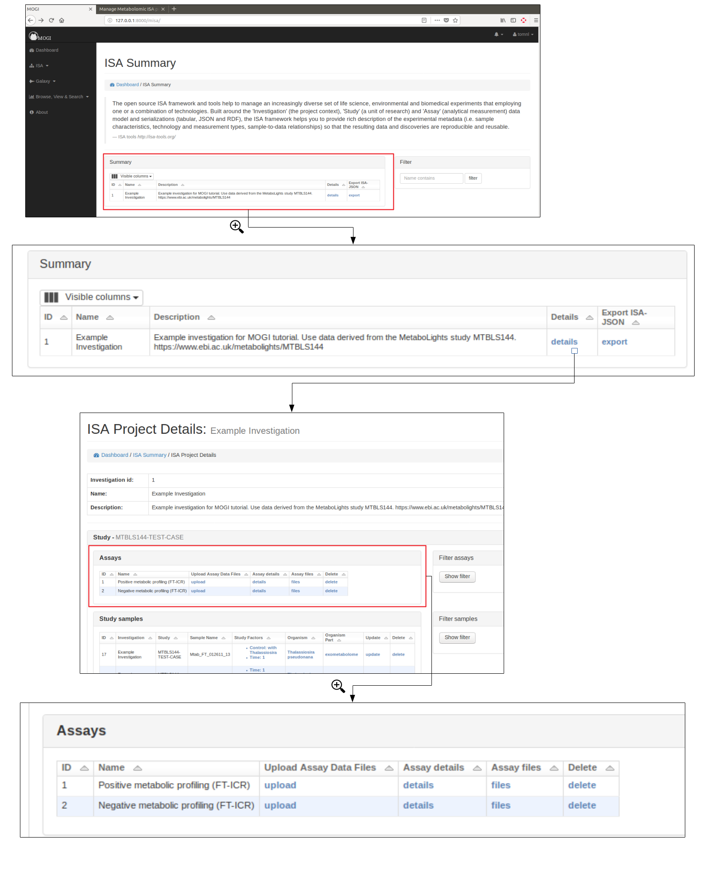
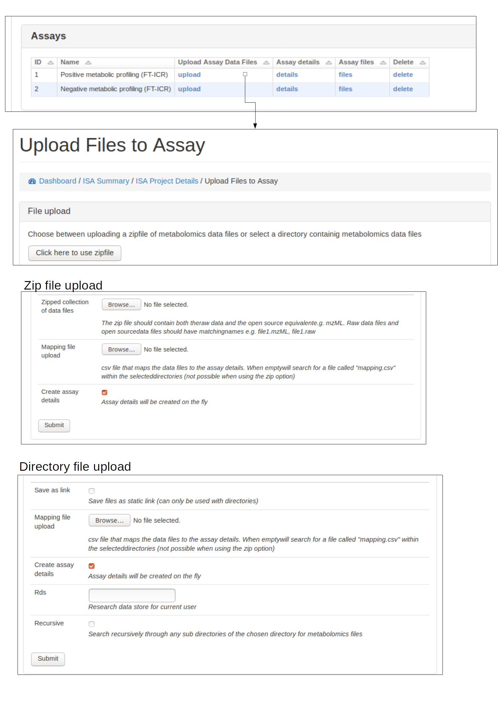

.. _misa-user-docs:

Manage Metabolomic ISA projects
========================================

The functionality is summarised along with any current ISA projects at http://127.0.0.1:8000/misa/

Create ISA backbone
''''''''''''''''''''''''''''''''''''''''''''''''''

To initiate an ISA project the backbone of the ISA project has to be created. e.g. the investigation, study and assay
details.

First an investigation has to be created, this only requires the name of the overall ISA project and a short description.
One or more studies can then be created and assigned to an investigation. Further details are added at this stage including
any study descriptors.

Multiple assays can then be added to each study.

.. image:: misa-create-base.png

Browse and export ISA projects
''''''''''''''''''''''''''''''''''''''''''''''''''

Once an investigation has been created. The ISA project will be visible in the summary table. Further details can
then be shown by clicking on the details section.

Preliminary work has been made so that the ISA project can be exported as an ISA-JSON file.

Currently only admin users can delete the projects via the standard Django admin interface (e.g. at 127.0.0.1:8000/admin).

.. image:: summary-options.png

Ontologies
''''''''''''''''''''''''''''''''''''''''''''''''''

Browse, update and delete ontology terms
~~~~~~~~~~~~~~~~~~~~~~~~~~~~~~~~~~~~~~~~~~~~
Where possible ontological terms are used to describe components of the ISA project. The full list of ontology terms
used for a project can be searched, updated and viewed (see below)

.. image:: ontology1.png

Add new terms
~~~~~~~~~~~~~~~~~~~~~~~~~~~~~~~~~~~~~~~~~~~~
New ontological terms can be added manually or can be searched using the EBI ontology Lookup service and the best
term can be added into the local database of ontology terms.

.. image:: ontology2.png

Protocols
''''''''''''''''''''''''''''''''''''''''''''''''''

Browse protocols
~~~~~~~~~~~~~~~~~~~~~~~~~~~~~~~~~~~~~~~~~~~~

Protocol models have been created based on the MetaboLights description for metabolomics projects and consists
of sample collection, (liquid phase)-extraction, (solid phase)-extraction, chromatography,
measurement (i.e. mass spectrometry type), data transformation and metabolite identification.

Create, edit and delete protocols
~~~~~~~~~~~~~~~~~~~~~~~~~~~~~~~~~~~~~~~~~~~~

A user can view, edit and delete protocols, see below for example using the Chromatography protocol. An important
field for a protocol is the **code_field** this is a unique small code for a protocol that can be used later when linking
uploaded data files to a specific protocol.

.. image:: protocol2.png

Protocol types
~~~~~~~~~~~~~~~~~~~~~~~~~~~~~~~~~~~~~~~~~~~~

Where possible, protocols can be grouped together by different protocol types. For example a Chromatography protocol
can be associated with either the Chromatography type 'HILIC' or 'reverse phase chromatography' (see below). A user can add and edit as many different
protocol types as necessary.

.. image:: protocol3.png

Study samples
''''''''''''''''''''''''''''''''''''''''''''''''''
Browse, create, update and delete study samples
~~~~~~~~~~~~~~~~~~~~~~~~~~~~~~~~~~~~~~~~~~~~~~~~~~~~~~~~~~~~~~~~~~~~~~~~~~~~~~~~~~~~~~~~
Study samples can be browsed, created and edited.

Study factors, organisms and organism parts
~~~~~~~~~~~~~~~~~~~~~~~~~~~~~~~~~~~~~~~~~~~~~~~~~~~~~~~~~~~~~~~~~~~~~~~~~~~~~~~~~~~~~~~~
Each study factor can be associated with an organism and organism part as well as multiple study factors.

Add study samples (batch)
~~~~~~~~~~~~~~~~~~~~~~~~~~~~~~~~~~~~~~~~~~~~
For studies with many samples it is recommended to batch upload the study samples. Relevant ontology terms will be
automatically uploaded based on the sample list provided. The columns of the sample list should consist of the
following column titles:

- **source_name**: Source of the sample (e.g. Acme laboratories).
- **sample_name**: Study sample name (needs to be unique for the study).
- **organism**: Organism name (e.g. *Daphnia magna*). Best matching ontological term will be automatically searched.
- **organism_part**: The part of the organism for the sample (e.g. heart, lung). Best matching ontological term will
  be automatically searched.
- **factor_[<--name of study factor-->]**: A study factor for the sample. The column name will change based on
  the factor type e.g. \factor_[time]. Relevant ontological terms will be automatically searched.
- **factor_[<--name of study factor-->]_unit**: Optionally a unit for the study factor can be used. The column should
  match the study factor type e.g \factor_[time]_unit.  Relevant ontological terms will be automatically searched.

Multiple factor columns can be used
e.g.

+-----------------------------------------------+---------------------+---------------------------+----------------+----------------+---------------------+--------------------+
| \source_name                                  | \sample_name        | \organism                 | \organism_part | \factor_[time] | \factor_[time]_unit | \factor_[control]  |
+===============================================+=====================+===========================+================+================+=====================+====================+
| Acme laboratories                             |  Mtab_FT_012611_13  |  Thalassiosira pseudonana | exometabolome  | 1              | day                 | with Thalassiosira |
+-----------------------------------------------+---------------------+---------------------------+----------------+----------------+---------------------+--------------------+
| Acme laboratories                             |  Mtab_FT_012611_14  |  Thalassiosira pseudonana | exometabolome  | 2              | day                 | cell-free control  |
+-----------------------------------------------+---------------------+---------------------------+----------------+----------------+---------------------+--------------------+

Alternatively, if an ISA tab file has already been created. The study.txt file can be uploaded and the relevant details
will be extracted.

See below for how to upload study samples as a batch:

Study Factors
''''''''''''''''''''''''''''''''''''''''''''''''''
Browse, create, update and delete study factors
~~~~~~~~~~~~~~~~~~~~~~~~~~~~~~~~~~~~~~~~~~~~~~~~~~~~~~~~~~~~~~~~~~~~~~~~~~~~~~~~~~~~~~~~

Study factors can be either added manually (see below) or added with study samples in a batch process (see section
**Add study samples (batch)** above)

Organisms
''''''''''''''''''''''''''''''''''''''''''''''''''
Browse, create, update and delete organisms
~~~~~~~~~~~~~~~~~~~~~~~~~~~~~~~~~~~~~~~~~~~~~~~~~~~~~~~~~~~~~~~~~~~~~~~~~~~~~~~~~~~~~~~~
Organisms can be either added manually (see below) or added with study samples in a batch process (see section
**Add study samples (batch)** above)

.. image:: organism.png

Organism parts
''''''''''''''''''''''''''''''''''''''''''''''''''
Browse, create, update and delete organism parts
~~~~~~~~~~~~~~~~~~~~~~~~~~~~~~~~~~~~~~~~~~~~~~~~~~~~~~~~~~~~~~~~~~~~~~~~~~~~~~~~~~~~~~~~
Organisms parts can be either added manually (see below) or added with study samples in a batch process (see section
**Add study samples (batch)** above)

Assay details and data files
''''''''''''''''''''''''''''''''''''''''''''''''''
Select assay
~~~~~~~~~~~~~~~~~~~~~~~~~~~~~~~~~~~~~~~~~~~~~~~~~~~~~~~~~~~~~~~~~~~~~~~~~~~~~~~~~~~~~~~~
To upload data files (e.g. mzML) to an assay, first an assay needs to have been created for the appropriate study (see
section **Create ISA backbone**. The assay should then be viewable in the Investigation details section. See below for
example:

Upload data files and mapping
~~~~~~~~~~~~~~~~~~~~~~~~~~~~~~~~~~~~~~~~~~~~~~~~~~~~~~~~~~~~~~~~~~~~~~~~~~~~~~~~~~~~~~~~
Data files (e.g. mzML, raw) should be uploaded to the appriopiate assay for a study. This can either be done by
uploading a zip file of the data files or providing a path to the data files if the file system is available.

A mapping file should be provided that links each file to sample and protocols. Each protocol has a 'code_field' to be
used to reference the correct protocol that was performed. See below for accepted column details

- **filename**: Name of the data file (e.g. sample1_lcms.mzML)
- **sample**: The sample name (should correspond to the sample name provided at earlier stages)
- **sample_collection**: The code_field for the sample collection protocol performed
- **extraction**: The code_field for the liquid phase extraction protocol performed
- **spe**: The code_field for the solid phase extraction protocol performed
- **spe_frac**: If SPE fractionation was performed resulting in multiple fractions, this column is to indicate the fraction number
- **chromatography**: The code_field for the chromatography protocol performed
- **chromatography_frac**: If chromatography fractionation was performed resulting in multiple fractions, this column is to indicate the fraction number
- **measurement**: The code_field for the measurement protocol performed
- **polarity**: The code_field for the polarity setting of the instrument
- **technical_replicate**: Numerical value indicating technical replicate
- **fileformat**: suffix of the file being uploaded (currently supports mzML and raw)

If a protocol was not used (e.g. if Chromatography was not performed) the column in the mapping file should be NA. See
below for example format:

+---------------------------+---------------------+--------------------+----------------+--------+----------+-----------------+----------------------+-------------+----------+---------------------+------------+
| filename                  | sample              | sample_collection  | extraction     | spe    | spe_frac | chromatography  | chromatography_frac  | measurement | polarity | technical_replicate | fileformat |
+===========================+=====================+====================+================+========+==========+=================+======================+=============+==========+=====================+============+
| Mtab_FT_012611_13_1.mzML  |  Mtab_FT_012611_13  |  DIATOM            |  DOM	        | DOM    | NA       | SFRP            | NA                   | FT-ICR      | POSITIVE | 1                   | mzml       |
+---------------------------+---------------------+--------------------+----------------+--------+----------+-----------------+----------------------+-------------+----------+---------------------+------------+
| Mtab_FT_012611_13_2.mzML  |  Mtab_FT_012611_13  |  DIATOM            |  DOM	        | DOM    | NA       | SFRP            | NA                   | FT-ICR      | POSITIVE | 2                   | mzml       |
+---------------------------+---------------------+--------------------+----------------+--------+----------+-----------------+----------------------+-------------+----------+---------------------+------------+

