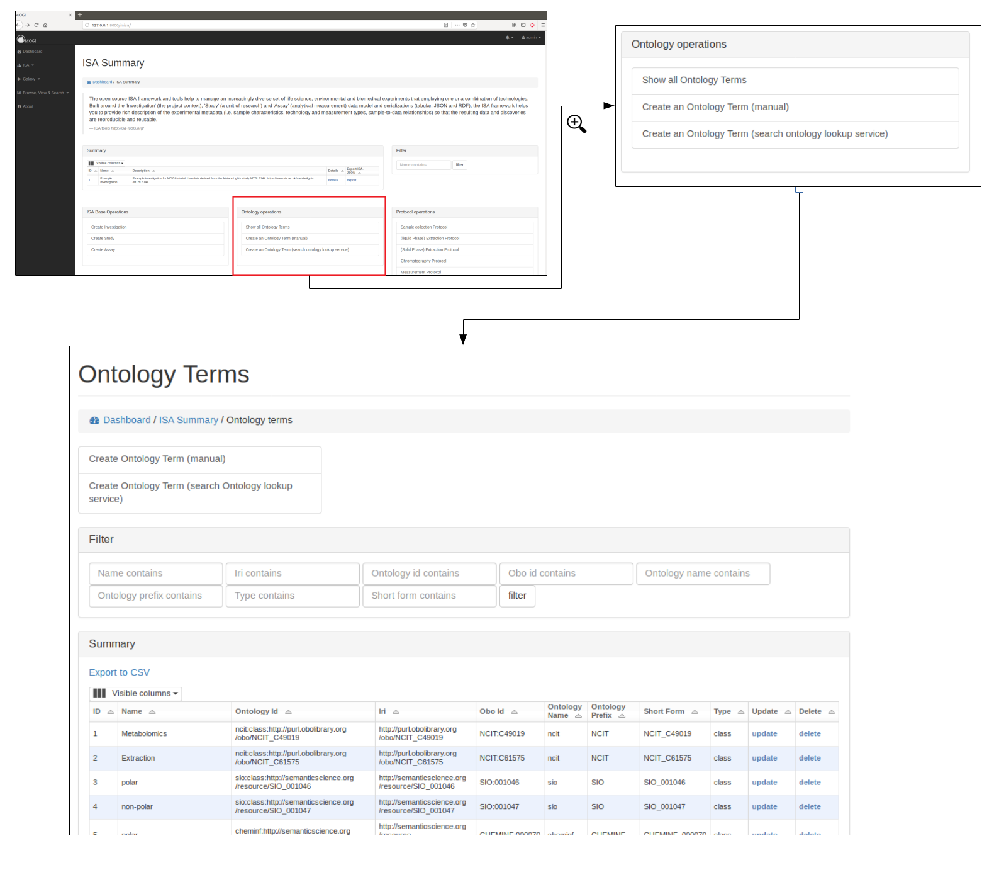

.. _misa-user-docs:

Manage Metabolomic ISA projects
========================================

The functionality is summarised along with any current ISA projects at http://127.0.0.1:8000/misa/

ISA backbone for a project
''''''''''''''''''''''''''''''''''''''''''''''''''

Create ISA backbone
~~~~~~~~~~~~~~~~~~~~~~~~~~~~~~~~~~~~~~~~~~~~

To initiate an ISA project the backbone of the ISA project has to be created. e.g. the investigation, study and assay
details.

First an investigation has to be created, this only requires the name of the overall ISA project and a short description.
One or more studies can then be created and assigned to an investigation. Further details are added at this stage including
any study descriptors.

Multiple assays can then be added to each study.

.. image:: misa-create-base.png

Browse ISA projects
~~~~~~~~~~~~~~~~~~~~~~~~~~~~~~~~~~~~~~~~~~~~

Once an investigation has been created. The ISA project will be visible in the summary table. Further details can
then be shown by clicking on the details section.

Preliminary work has been made so that the ISA project can be exported as an ISA-JSON file.

Currently only admin users can delete the projects via the standard Django admin interface (e.g. at 127.0.0.1:8000/admin).

.. image:: summary-options.png

Ontologies
''''''''''''''''''''''''''''''''''''''''''''''''''

Browse, update and delete ontology terms
~~~~~~~~~~~~~~~~~~~~~~~~~~~~~~~~~~~~~~~~~~~~
Where possible ontological terms are used to describe components of the ISA project. The full list of ontology terms
used for a project can be searched, updated and viewed (see below)

Add new terms
~~~~~~~~~~~~~~~~~~~~~~~~~~~~~~~~~~~~~~~~~~~~
New ontological terms can be added manually or can be searched using the EBI ontology Lookup service and the best
term can be added into the local database of ontology terms.

Protocols
''''''''''''''''''''''''''''''''''''''''''''''''''

Browse protocols
~~~~~~~~~~~~~~~~~~~~~~~~~~~~~~~~~~~~~~~~~~~~

Protocol models have been created based on the MetaboLights description for metabolomics projects and consists
of sample collection, (liquid phase)-extraction, (solid phase)-extraction, chromatography,
measurement (i.e. mass spectrometry type), data transformation and metabolite identification.

.. image:: protocol1.png

Create, edit and delete protocols
~~~~~~~~~~~~~~~~~~~~~~~~~~~~~~~~~~~~~~~~~~~~

A user can view, edit and delete protocols, see below for example using the Chromatography protocol. An important
field for a protocol is the **code_field** this is a unique small code for a protocol that can be used later when linking
uploaded data files to a specific protocol.

.. image:: protocol2.png

Protocol types
~~~~~~~~~~~~~~~~~~~~~~~~~~~~~~~~~~~~~~~~~~~~

Where possible, protocols can be grouped together by different protocol types. For example a Chromatography protocol
can be associated with either the Chromatography type 'HILIC' or 'reverse phase chromatography' (see below). A user can add and edit as many different
protocol types as necessary.

.. image:: protocol3.png

Organisms
''''''''''''''''''''''''''''''''''''''''''''''''''
Browse, create, update and delete organisms
~~~~~~~~~~~~~~~~~~~~~~~~~~~~~~~~~~~~~~~~~~~~~~~~~~~~~~~~~~~~~~~~~~~~~~~~~~~~~~~~~~~~~~~~

Browse, create, update and delete organism parts
~~~~~~~~~~~~~~~~~~~~~~~~~~~~~~~~~~~~~~~~~~~~~~~~~~~~~~~~~~~~~~~~~~~~~~~~~~~~~~~~~~~~~~~~

Study samples
''''''''''''''''''''''''''''''''''''''''''''''''''
Add study factors (manual)
~~~~~~~~~~~~~~~~~~~~~~~~~~~~~~~~~~~~~~~~~~~~

Add study samples (manual)
~~~~~~~~~~~~~~~~~~~~~~~~~~~~~~~~~~~~~~~~~~~~

Batch study samples and factor upload
~~~~~~~~~~~~~~~~~~~~~~~~~~~~~~~~~~~~~~~~~~~~

Assay files
''''''''''''''''''''''''''''''''''''''''''''''''''

Study samples
''''''''''''''''''''''''''''''''''''''''''''''''''
Browse, update and delete study samples
~~~~~~~~~~~~~~~~~~~~~~~~~~~~~~~~~~~~~~~~~~~~

Add study samples (manual)
~~~~~~~~~~~~~~~~~~~~~~~~~~~~~~~~~~~~~~~~~~~~

Add study samples (batch)
~~~~~~~~~~~~~~~~~~~~~~~~~~~~~~~~~~~~~~~~~~~~

Assay files
''''''''''''''''''''''''''''''''''''''''''''''''''

